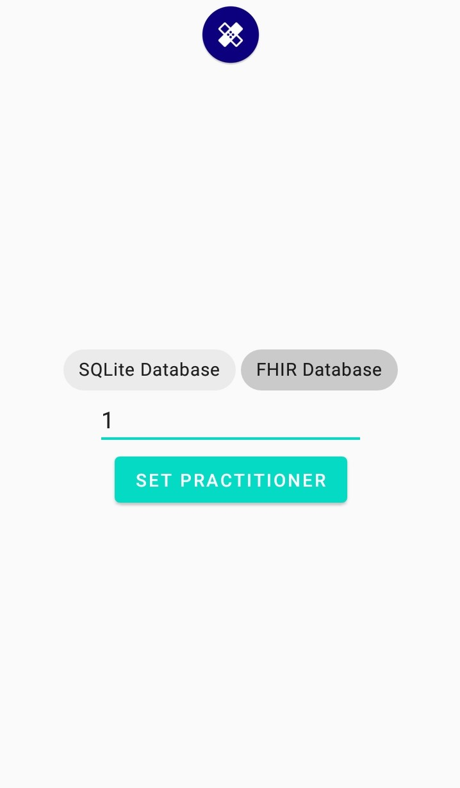
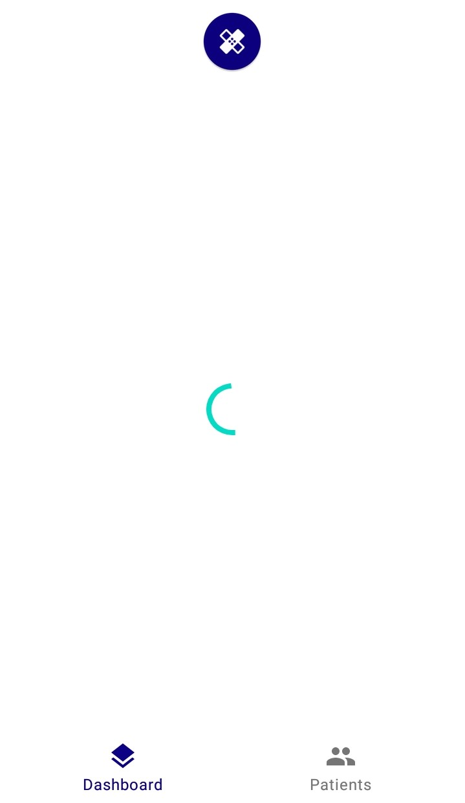
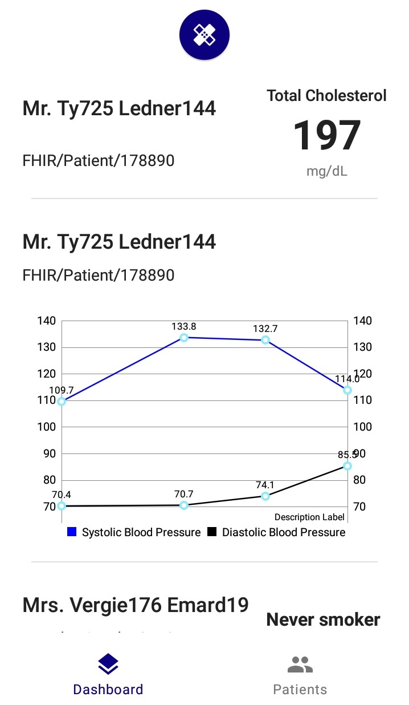
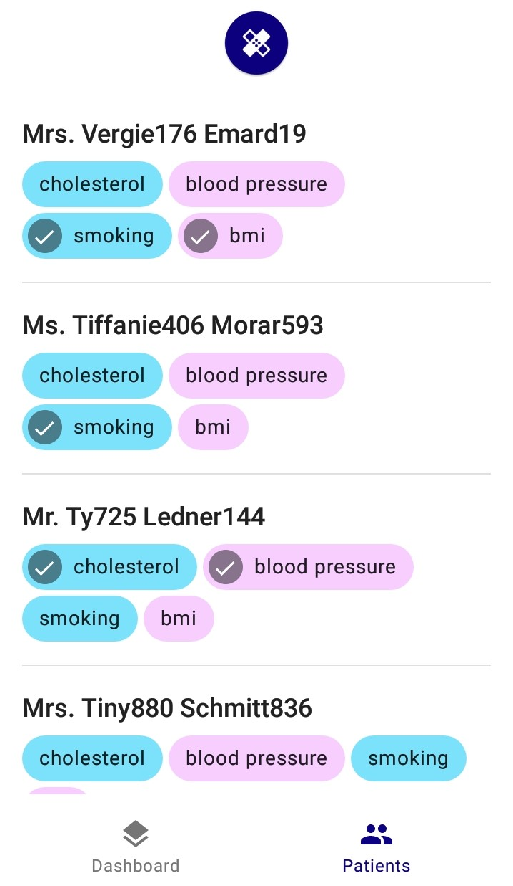

# Safehearts
An Android-FHIR app for medical practitioners to monitor patients' key health stats. Made for FIT3077 Software Architecture and Design.

## Smile Team
- Rohan Chandra (24147702)
- Asher Lim Zhi Rong (26741148)

## About FHIR
([FHIR](http://www.fhir.org/)) (Fast Health Interoperability Resources) is an HL7 specification for Healthcare Interoperability.

## Deliverables
1. UML design documents ([`./uml`](https://github.com/asherLZR/safehearts/tree/master/uml))
2. Source code ([`./app/app/src`](https://github.com/asherLZR/safehearts/tree/master/app/app/src))
3. Git log ([`git log`](https://github.com/asherLZR/safehearts/commits/master))
4. Design principles and patterns ([`./Report.pdf`](https://github.com/asherLZR/safehearts/blob/master/Report.pdf))

## Screenshots

 

