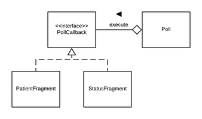

# FIT3077 - Smile - Assignment 2A

## Smile Team
- Rohan Chandra (24147702)
- Asher Lim Zhi Rong (26741148)

## Requirements
- [Android Studio](https://developer.android.com/studio/install)
- Android SDK
- Internet features requires [Monash VPN](https://www.monash.edu/esolutions/network/vpn)
- Android device (if testing without an emulator)
    - Developer mode enabled 
    - Min SDK 24, target SDK 28, API 28: Android 9.0 Pie
    - Cisco AnyConnect app with VPN running

## Tested Environments
- Android Virtual Device (Emulator), Pixel 2 API 28 (Android 9) x86 CPU
- Samsung Galaxy J5 Prime, SM-G570Y API 26 (Android 8.0.0)

## Building Smile
1. Open project in Android Studio
2. Run project in an Android emulator or device

## UML Diagrams
- [Class Diagram](./uml/ClassDiagram.pdf)
    - Does not show all class-to-class dependencies to avoid an illegible diagram. Instead, packages are shown to depend on each other.
- Sequence Diagrams
    - [Input Practitioner ID](./uml/sequence_diagrams/InputPractitionerId.png)
    - [Polling Data from the Server](./uml/sequence_diagrams/PollingData.png)
    - [Toggling Patient Monitor](./uml/sequence_diagrams/TogglePatientMonitor.png)

## Functional Description
Our implementation of the Safe❣Heart application presents a chosen practitioner with a list of all their associated patients, pulled from the [FHIR](http://www.hl7.org/FHIR/) server, allowing them to optionally add monitors to various observation types (e.g. Cholesterol). 

These patient observations are presented to the practitioner on a dashboard, which refreshes its data (i.e. pull new observations from the server) every hour.

## Design principles and patterns
Smile uses its own internal data models like `ShPatientReference` and `ShPatient`. These objects are created by the `HealthService` class, defined as abstract to enforce a standard interface for all services. 

The **adapter pattern**, adds a layer of abstraction so interoperability may be achieved. By adapting the service-specific model to the specified internal interface, we achieve **dependency inversion** - clients rely not on a `FhirService` but a `HealthService`, which in turn informs the implementation of `FhirService`. The benefit of this approach is that the rest of the app does not rely on a concrete service, which leads to improved extensibility when services are added in the future.

The **observer pattern** ensures that the UI is updated when the underlying data changes. We have used the observer pattern as the UI needs to react to multiple events, such as loading the asynchronously from the network and refreshing the data every hour).

The **model-view-controller (MVC) architectural pattern** is used throughout the app to aid in separation of concerns. The benefit of our approach is that the business logic of the app (such as persistence) can be changed independently of the UI, which reduces bugs caused by tightly coupled code (i.e. code that combines both the Android API and business logic in a single class). A related benefit is that the view layer can be easily changed, promoting extensibility of our solution.