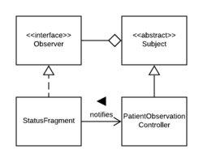
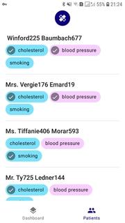

## Model-view-controller (MVC)
The MVC architectural pattern is used throughout Smile to aid in separation of concerns. The benefit of our approach is that the business logic of the app (such as persistence) can be changed independently of the UI, which reduces bugs caused by tightly coupled code (i.e. code that combines both the Android API and business logic in a single class). A related benefit is that the view layer can be easily changed, promoting **extensibility** of our solution.

## Adapter pattern

In the model layer, the adapter pattern adds a layer of abstraction so interoperability may be achieved. By adapting the service-specific model to the specified internal interface, we achieve **dependency inversion** - clients rely not on a `FhirService` but a `HealthService`. The benefit of this approach is that the rest of the app does not rely on a concrete service, which leads to improved extensibility when services are added in the future.

## Strategy pattern
The `ObservedPatient` model is composed of two strategies for the alerting and charting.

By using the strategy pattern (where behaviours are provided as dependencies), we are can easily switch the behaviour at runtime. This promotes a high degree of code reuse where common behaviours can be shared and applies the "Don't repeat yourself" (DRY) principle. For example, both the cholesterol `ObservedPatient` and the smoking `ObservedPatient` share the same strategy for not displaying an alert. This reduces bugs caused by code duplication.

## Composition over inheritance
We favoured **composition** over inheritance in `ObservedPatient` for the relevant behaviours due to the "has-a" nature of their relationship. While the same functions could be achieved with inheritance (including multiple inheritance in a language which allows it), they run the risk of becoming increasingly static. Composition encourages better **encapsulation** as behaviour code doesn't directly affect the composed object. In inheritance however, subclasses are strongly **coupled** with their supertypes; as stated in **Liskov's Substitution Principle**, they rely on the substitutability of a superclass for its subclass. 

One drawback of composition however is due to its flexibility - it runs the risk of being difficult to understand if the behaviours are changed constantly at runtime.

## Factory method pattern
`ObservedPatient` objects are instantiated by the client through the `ObservedPatientFactory`. This increases **cohesion** within the package and absolves all clients from containing creation logic, including dependencies and object types, that may potentially change over time.

## Observer pattern

Within Smile's UI, the observer pattern ensures the UI is kept in sync with changes to data. This pattern was used as the UI reacts to multiple events, such as loading the asynchronously from the network and refreshing the data hourly.

The benefit of this pattern is that the observer and the subject are **decoupled** (Giridhar, 2016), which makes it easy to change the UI code independently of the code which updates the data. However, the observer pattern does add complexity to the code. For example, you must remember to unregister observers to prevent memory leaks (Nystrom, 2014). This adds to the cognitive load of understanding our codebase, however we have attempted to counteract this by documentation which explains our code.

## Simple factory idiom
We have used the simple factory idiom to encapsulate the logic related to creating concrete classes from the rest of Smile (Sierra, Bates, Robson, & Freeman, 2004), such as `HealthServiceProducer` to create the concrete health service.

One negative is that more complex creational logic would be better suited for patterns such as the abstract factory pattern, however we believe the our approach is beneficial given the relative simplicity of the logic. The benefits of the simple factory idiom far outweigh this negative, given that the creational logic is not duplicated and the logic can be changed in one place (i.e. the code is DRY). 

## Problems encountered
Dealing with the FHIR API was difficult due to the inconsistent nature of the data. We have ameliorated issues from the inconsistent API by creating our own model classes, and restricting the FHIR library to the service layer.

Additionally, we encountered problems dealing with multiple view types (for example, textual with the status card and a graph for the blood pressure). Our solution was to use inheritance, whereby the common view was extracted (into the `BaseCardViewHolder` class), then we created separate classes for each category of views (numeric, textual or a graph). This approach makes it easy to add new monitors with minimal change to the code as we anticipate most monitors will be one of these formats.

## Alternative design patterns
We considered using a reactive-style framework such as React or Flutter, where the user interface is a function of the data and data binding affordances are provided. This approach could lead to more efficient code in the view layer, as these frameworks optimize updating small portions of the UI in reaction to new data. Instead of these frameworks, we implemented a simpler Observer pattern (see above).

Java 8 also introduced the functional programming paradigm, which promotes useful concepts such as immutability, higher-order functions, non-imperative "loops" (map, filter, reduce). These have the benefit of reducing side-effects and having more concise representations.

We decided against using the above as the assignment is focused on OOP concepts. 

\newpage

# References
Giridhar, C. (2016). Learning Python Design Patterns (Second edition). Birmingham Mumbai: Packt Publishing.

Nystrom, R. (2014). Game programming patterns. Genever Benning.

Sierra, K., Bates, B., Robson, E., & Freeman, E. (2004, October). The Factory Pattern: Baking with OO Goodness - Head First Design Patterns. Retrieved May 16, 2019, from O’Reilly Safari website: https://www.oreilly.com/library/view/head-first-design/0596007124/ch04.html

\newpage

# Appendix

## Requirements
- [Android Studio](https://developer.android.com/studio/install)
- Android SDK
- Internet features requires [Monash VPN](https://www.monash.edu/esolutions/network/vpn)
- Android device (if testing without an emulator)
    - Developer mode enabled 
    - Min SDK 24, target SDK 28, API 28: Android 9.0 Pie
    - Cisco AnyConnect app with VPN running

## Tested Environments
- Android Virtual Device (Emulator), Pixel 2 API 28 (Android 9) x86 CPU
- Samsung Galaxy J5 Prime, SM-G570Y API 26 (Android 8.0.0)

## External Libraries
- [MPAndroid Chart](https://github.com/PhilJay/MPAndroidChart) for plotting Blood Pressure line charts.
- [AdapterDelegates](https://github.com/sockeqwe/AdapterDelegates) for managing multiple CardHolders.

## Building Smile
1. Open project in Android Studio
2. Run project in an Android emulator or device

## Functional Description
Our implementation of the SafeHeart application (known as **Smile**) presents a chosen practitioner with a list of all their associated patients, pulled from the [FHIR](http://www.hl7.org/FHIR/) server, allowing them to optionally add monitors to various observation types (e.g. Cholesterol). 

These patient observations are presented to the practitioner on a dashboard, which refreshes its data (i.e. pulls new observations from the server) every hour.

## UML Diagrams
- [Class Diagram](./uml/ClassDiagram.pdf)
    - Does not show all class-to-class dependencies to avoid an illegible diagram. Instead, packages are shown to depend on each other.
- Sequence Diagrams
    - [Input Practitioner ID](./uml/sequence_diagrams/InputPractitionerId.png)
    - [Polling Data from the Server](./uml/sequence_diagrams/PollingData.png)
    - [Toggling Patient Monitor](./uml/sequence_diagrams/TogglePatientMonitor.png)